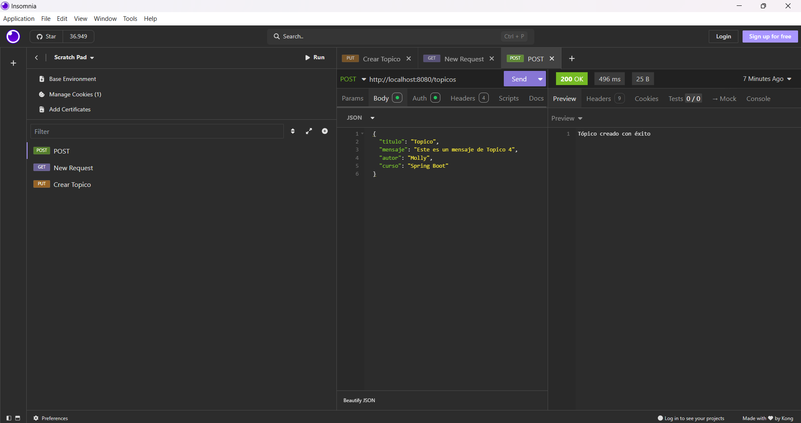
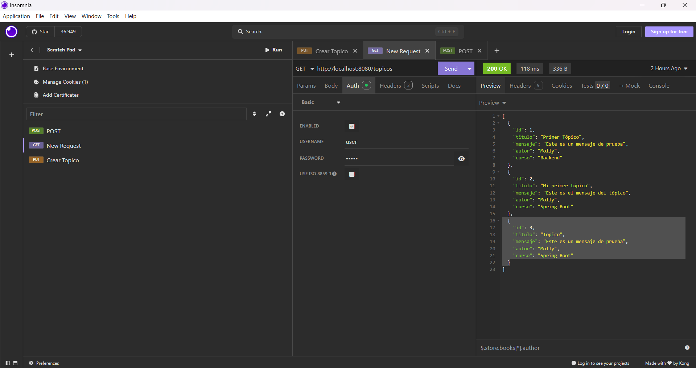

# 📌 Forohub

✨ **¿Qué hace este programa?**  
Forohub es un backend en **Spring Boot** que permite gestionar tópicos en un foro, usando **MySQL** como base de datos.  
Está diseñado para almacenar y listar información desde la base de datos.

## 🚀 Funcionalidades principales

Con Forohub puedes:  

- 🔹 Listar todos los tópicos almacenados en la base de datos.  
- 🔹 Registrar nuevos tópicos (con título y descripción).  
- 🔹 Conectarte a la base de datos MySQL usando HikariCP.  

## 🛠 Tecnologías utilizadas

- Java 21  
- Spring Boot 3.3.4  
- Spring Data JPA  
- MySQL  
- HikariCP  

## 💻 Cómo ejecutar el proyecto

1. Asegúrate de tener MySQL corriendo y la base de datos `forohub` creada.  
2. Configura tu `application.properties` con los datos de la base de datos.

📸 Demostración visual de Post y Get desde Insomnia:
🟢 Datos ingresados y obtenidos con éxito:

--

